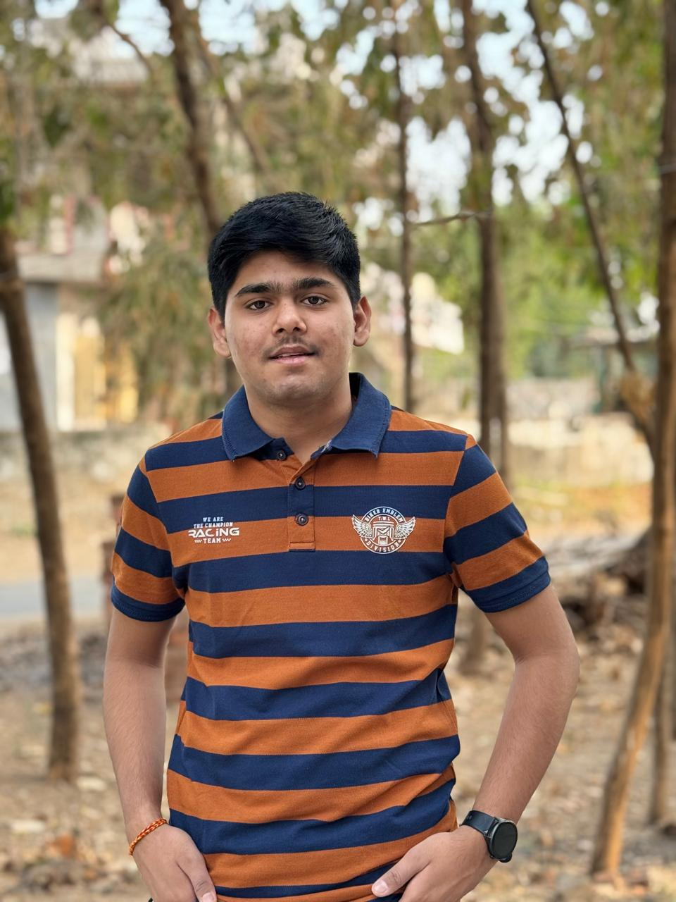

# Hi there, I'm Saras Patel! 👋  

  

Welcome to my GitHub profile! I'm a passionate student and developer currently studying at **Charusat University**. I love exploring new technologies, solving problems, and building interesting projects.

## 🚀 About Me

* 🎓 I'm currently a student at **Charusat University**.
* 🌱 I'm constantly learning and expanding my skill set.
* 💡 I enjoy writing clean code and tackling complex logic problems.
* 📫 How to reach me: [patelsaras611@gmail.com](mailto:patelsaras611@gmail.com) 

## 🛠️ Languages & Tools

Here are the technologies I currently work with:

* **Programming Languages:** C++, Python
* **Web Development:** HTML

## 📁 Featured Repositories

* 💻 **[CPP Repository](https://github.com/SarasPatel0611/CPP)** - Check out my C++ practice code and projects here!

## 📈 GitHub Stats

<!-- To show live stats, simply remove the "<!--" and "-->" arrows above and below the images -->
<!-- 

-->

 

---
⭐️ *Thanks for visiting my profile! Feel free to check out my repositories below.*
